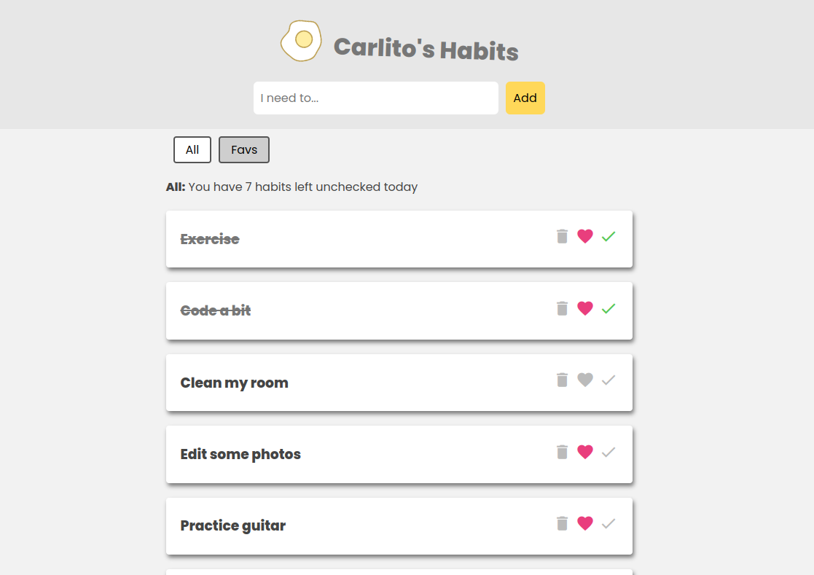

# vue-pinia-habit-tracker -- Sunny Side Up!
# This is a concept Vue project

Started this project to practice some `Vue.js` + `Pinia` for store management.
The project is a simple habit tracker application, that allows to keep track of the habits the user wants to follow.

## How to run it?
Go into the main directory of this project:
```
cd vue-pinia-habit-tracker/habit-tracker/
```
To run the json database, use:
```
json-server -w data/db.json
```

After that, serve the site with npm

```
npm run serve
```

Check [http://localhost:5173/](http://localhost:5173/)


### Preview


### Is the site hosted?

! Not ready yet
